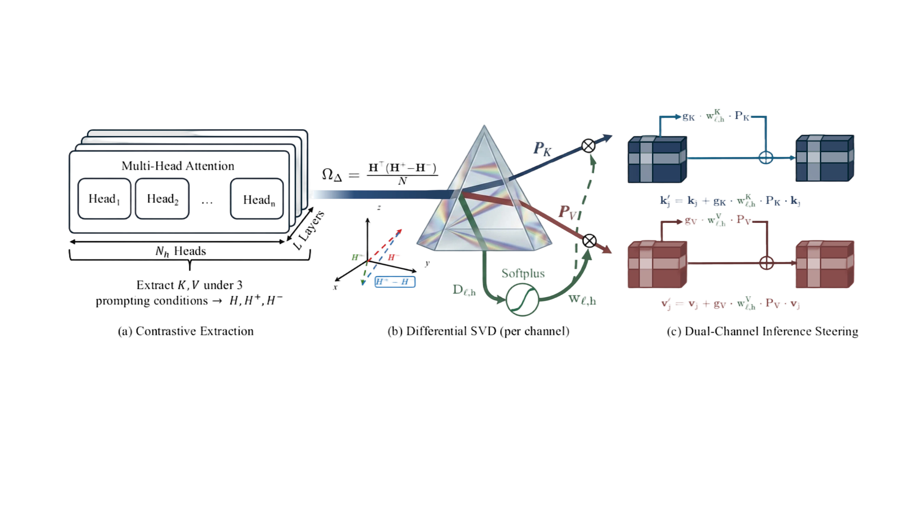

# PRISM-Delta

**Projection-based Relevance-Informed Steering Method** for prompt highlighting in large language models.

PRISM-Delta steers both Key and Value channels of Transformer attention via differential cross-covariance decomposition and per-head softplus weighting. It is training-free, compatible with FlashAttention, and adds negligible memory overhead.

<p align="center">
  
</p>

## Installation

```bash
pip install -r requirements.txt
python -m spacy download en_core_web_sm
python -c "import nltk; nltk.download('punkt_tab')"
```

## Quick Start: BiasBios Demo

### Step 0: Download models and data

**Models** (any of the following):

| Model | HuggingFace Link |
|-------|-----------------|
| Qwen3-4B-Base | [Qwen/Qwen3-4B-Base](https://huggingface.co/Qwen/Qwen3-4B-Base) |
| Qwen3-8B-Base | [Qwen/Qwen3-8B-Base](https://huggingface.co/Qwen/Qwen3-8B-Base) |
| Qwen3-14B-Base | [Qwen/Qwen3-14B-Base](https://huggingface.co/Qwen/Qwen3-14B-Base) |
| Gemma3-4B-PT | [google/gemma-3-4b-pt](https://huggingface.co/google/gemma-3-4b-pt) |
| Gemma3-12B-PT | [google/gemma-3-12b-pt](https://huggingface.co/google/gemma-3-12b-pt) |

**Dataset**: Download [SEKA-datasets](https://huggingface.co/datasets/waylonli/SEKA-datasets) and place under a local directory (e.g., `./datasets/`). This includes BiasBios, CounterFact (pasta\_bench), and Pronoun Change evaluation data.

### Step 1: Build projection

```bash
# PRISM-K (Key-only differential projection)
CUDA_VISIBLE_DEVICES=0 python src/custom_builders/synthetic_qa_builder.py \
  --model <path-to-model> \
  --data data/synthetic/pair_qa_new.jsonl \
  --output_dir ./projections/biasbios/prism \
  --max_samples 200 --min_diff 0.08 --top_pct 0.998 \
  --diff-only

# PRISM-KV (Key+Value differential projection)
CUDA_VISIBLE_DEVICES=0 python src/custom_builders/synthetic_qa_builder.py \
  --model <path-to-model> \
  --data data/synthetic/pair_qa_new.jsonl \
  --output_dir ./projections/biasbios/prism-kv \
  --max_samples 200 --min_diff 0.08 --top_pct 0.998 \
  --kv-diff-only
```

### Step 2: Run evaluation

```bash
export PYTHONPATH=$(pwd)

# Vanilla (no steering)
CUDA_VISIBLE_DEVICES=0 python benchmarks/eval_bias_gen.py \
  --model <path-to-model> \
  --data_path <path-to-biasbios.json> \
  --output_dir ./results/vanilla \
  --overwrite_output_dir --batch_size 256 --max_new_tokens 64

# PRISM-K
CUDA_VISIBLE_DEVICES=0 python benchmarks/eval_bias_gen.py \
  --model <path-to-model> \
  --data_path <path-to-biasbios.json> \
  --output_dir ./results/prism-k \
  --overwrite_output_dir --batch_size 256 --max_new_tokens 64 \
  --wd-seka --wd-seka-proj ./projections/biasbios/prism/<model-name>_diff_proj.pt \
  --wd-seka-gain 0.40 --layers all

# PRISM-KV
CUDA_VISIBLE_DEVICES=0 python benchmarks/eval_bias_gen.py \
  --model <path-to-model> \
  --data_path <path-to-biasbios.json> \
  --output_dir ./results/prism-kv \
  --overwrite_output_dir --batch_size 256 --max_new_tokens 64 \
  --kv-seka --kv-seka-proj ./projections/biasbios/prism-kv/<model-name>_kv_diff_proj.pt \
  --kv-seka-gain-k 0.40 --kv-seka-gain-v 0.10 --layers all
```

### CounterFact

```bash
# PRISM-K on CounterFact (test set: 5000:10000)
CUDA_VISIBLE_DEVICES=0 python benchmarks/eval_fact_gen.py \
  --model <path-to-model> \
  --data_path <path-to-pasta_bench> \
  --output_dir ./results/counterfact/prism-k \
  --overwrite_output_dir --batch_size 128 --max_new_tokens 32 \
  --example_subset 5000:10000 \
  --wd-seka --wd-seka-proj <path-to-diff_proj.pt> \
  --wd-seka-gain 2.50 --layers all
```

### Pronoun Change

```bash
# PRISM-K on Pronoun Change (test set: 5000:10000)
CUDA_VISIBLE_DEVICES=0 python benchmarks/eval_biasbios_instruction.py \
  --model <path-to-model> \
  --data_path <path-to-biasbios.json> \
  --output_dir ./results/pronoun/prism-k \
  --overwrite_output_dir --batch_size 64 --max_new_tokens 128 \
  --task pronchange --example_subset 5000:10000 \
  --wd-seka --wd-seka-proj <path-to-diff_proj.pt> \
  --wd-seka-gain 0.05 --layers all
```

### Recommended hyperparameters

| Model | gamma | delta_min | g_K | Batch Size |
|-------|-------|-----------|-----|------------|
| [Qwen3-4B-Base](https://huggingface.co/Qwen/Qwen3-4B-Base) | 0.998 | 0.08 | 0.40 | 256 |
| [Qwen3-8B-Base](https://huggingface.co/Qwen/Qwen3-8B-Base) | 0.998 | 0.08 | 0.40 | 128 |
| [Qwen3-14B-Base](https://huggingface.co/Qwen/Qwen3-14B-Base) | 0.998 | 0.08 | 0.40 | 64 |
| [Gemma3-4B-PT](https://huggingface.co/google/gemma-3-4b-pt) | 0.850 | 0.08 | 0.50 | 256 |
| [Gemma3-12B-PT](https://huggingface.co/google/gemma-3-12b-pt) | 0.990 | 0.04 | 0.40 | 64 |

## Method Overview

PRISM-Delta learns discriminative subspaces from synthetic contrastive data offline, then applies per-head weighted projections at inference time:

1. **Differential cross-covariance**: SVD of (Omega+ - Omega-) extracts directions that distinguish relevant from irrelevant conditions, automatically eliminating shared variance.
2. **Softplus head weighting**: Each head receives a continuous importance weight based on its discriminability score, replacing binary hard thresholds.
3. **Dual-channel steering**: Optionally steers both Key (routing) and Value (content) channels simultaneously.

## Acknowledgments

This work builds on [**SEKA**](https://github.com/waylonli/SEKA), [**SEA-LLM**](https://github.com/yfqiu-nlp/sea-llm), [**PASTA**](https://github.com/QingruZhang/PASTA), [**Selective Prompt Anchoring**](https://github.com/magic-YuanTian/Selective-Prompt-Anchoring).